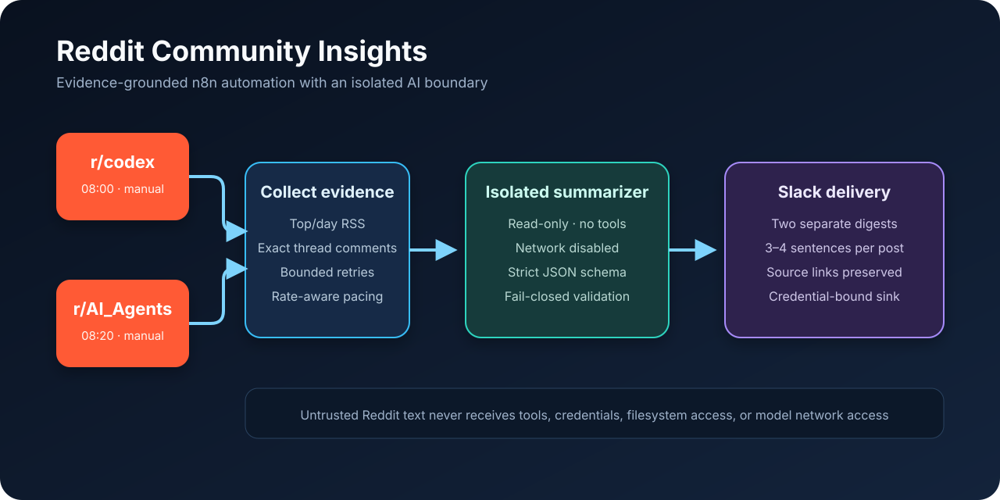

# Reddit Community Insights with n8n

An n8n workflow that reviews the daily top discussions in
`r/codex` and `r/AI_Agents`, samples comments from the exact Reddit threads,
creates evidence-grounded 3–4 sentence summaries, and sends one Slack digest
per community.



## What this demonstrates

- Self-hosted n8n orchestration with independent schedules and manual test paths.
- Public RSS ingestion, bounded retries, and rate-limit-aware comment collection.
- Structured AI output instead of free-form text parsing.
- A narrow, containerized summarization service with prompt-injection defenses.
- Credential isolation: the importable workflow contains no tokens, credential
  references, private hostnames, or real Slack destination IDs.
- Automated tests for workflow structure, request validation, authentication,
  Reddit feed parsing, output policy, and error redaction.

## Runtime flow

Each subreddit is an independent lane:

1. A schedule or manual trigger starts the lane.
2. n8n reads Reddit's public `Top/day` RSS feed and keeps the first three valid
   entries in the order Reddit returned them.
3. A wait node respects the observed public Reddit rate window.
4. The sidecar requests the exact thread comment feeds, sequentially, and keeps
   at most ten public comments per displayed post.
5. n8n assembles a bounded evidence object containing only the post, link, and
   sampled comments.
6. The isolated summarizer returns exactly one 3–4 sentence summary per post.
7. n8n validates and formats the result, then posts a separate digest to Slack.

The two production schedules are intentionally staggered in the workflow:

| Community | Schedule | Manual trigger |
| --- | --- | --- |
| `r/codex` | Daily at 08:00 | `Manual - r-codex` |
| `r/AI_Agents` | Daily at 08:20 | `Manual - r-AI_Agents` |

The workflow timezone is `Asia/Manila`. n8n's canvas-level **Execute workflow**
runs only the manual trigger selected beside the button; it does not start both
independent lanes at once.

## What “top” means

“Top discussions” is not an AI-generated ranking. It means the first three
valid posts returned by each subreddit's public Reddit `Top/day` RSS feed at
execution time. Comment text is a bounded sample from each exact thread's RSS
feed sorted by Reddit's `top` parameter; it is not a complete sentiment study.

## Quick start

### Prerequisites

- Self-hosted n8n 2.x on Docker.
- Docker Compose and Node.js 22 for local verification.
- A Slack credential that can post to the chosen channel or direct message.
- Access to Codex CLI device authentication for the isolated sidecar. This
  reference implementation does not require an OpenAI API key, but account and
  plan availability can change; confirm the current Codex CLI terms before use.

### 1. Import the workflow

Import [`workflow/reddit-community-digest.json`](workflow/reddit-community-digest.json)
from n8n's workflow menu. The file is deliberately inactive and unbound.

### 2. Deploy the sidecar

```bash
cd sidecar
mkdir -p secrets
openssl rand -hex 32 > secrets/service_token
cp ../.env.example ../.env
docker compose --env-file ../.env build
```

Authenticate the isolated Codex volume without copying OAuth material into n8n:

```bash
docker compose --env-file ../.env run --rm --entrypoint node summary-sidecar \
  /app/node_modules/@openai/codex/bin/codex.js login --device-auth
docker compose --env-file ../.env up -d
```

The Compose project expects the existing external Docker network `n8n_default`.
Change that network name only if your n8n deployment uses a different one.

### 3. Bind credentials in n8n

Create and bind two credentials after import:

- **HTTP Header Auth** for the four sidecar HTTP nodes. Header name:
  `Authorization`; value: `Bearer <contents of sidecar/secrets/service_token>`.
- **Slack API** for both Slack nodes.

Replace `YOUR_SLACK_CHANNEL_ID` in both Slack nodes with the intended channel or
direct-message ID. Never commit the edited, credential-bound production export.

### 4. Test and activate

Run each manual trigger separately, verify both Slack messages, then activate the
workflow. A complete lane can take several minutes because Reddit requests are
intentionally paced.

## Security design

Reddit posts and comments are untrusted input. The summarizer prompt labels them
as quoted evidence, but the prompt is only one layer. The enforceable controls
are described in [`SECURITY.md`](SECURITY.md) and include:

- fixed subreddit and URL allowlists;
- bounded request and output sizes;
- a fresh model thread for every request;
- read-only execution with network, web search, approvals, and tools disabled;
- an explicit child-process environment allowlist;
- schema validation plus rejection of tool activity and secret-like output;
- bearer authentication, timing-safe token comparison, and generic errors;
- a non-root, read-only, capability-free, resource-limited container.

## Verification

```bash
node scripts/validate-workflow.mjs workflow/reddit-community-digest.json
cd sidecar
npm ci --ignore-scripts
npm test
npm audit --omit=dev
docker compose --env-file ../.env.example config --quiet
```

The live canary in `sidecar/test/live-canary.mjs` is intentionally not part of
CI because it requires a running authenticated sidecar. It verifies rejection of
bad authorization, normal structured summarization, and safe handling of a
prompt-injection payload without printing credentials.

## Repository map

```text
.
├── workflow/             Sanitized, importable n8n workflow
├── sidecar/              Isolated Codex summarization service and tests
├── scripts/              Workflow sanitization and validation tools
├── docs/                 Architecture and public-reference review
├── assets/               Recruiter-facing architecture visual
├── SECURITY.md           Threat model and reporting guidance
└── .github/workflows/    Credential-free CI checks
```

## Honest limitations

- Reddit RSS is a public, rate-limited interface and can be unavailable or omit
  content visible in Reddit's web UI.
- The digest summarizes three posts and up to ten sampled comments per post; it
  does not claim statistical coverage or community consensus.
- Comment scores are not available in the RSS evidence and are not invented.
- Delivery depends on the operator's Slack permissions and self-hosted n8n
  reliability.
- The sidecar is purpose-built for these two communities, not a general agent or
  arbitrary URL-fetching service.

## License

[MIT](LICENSE)
